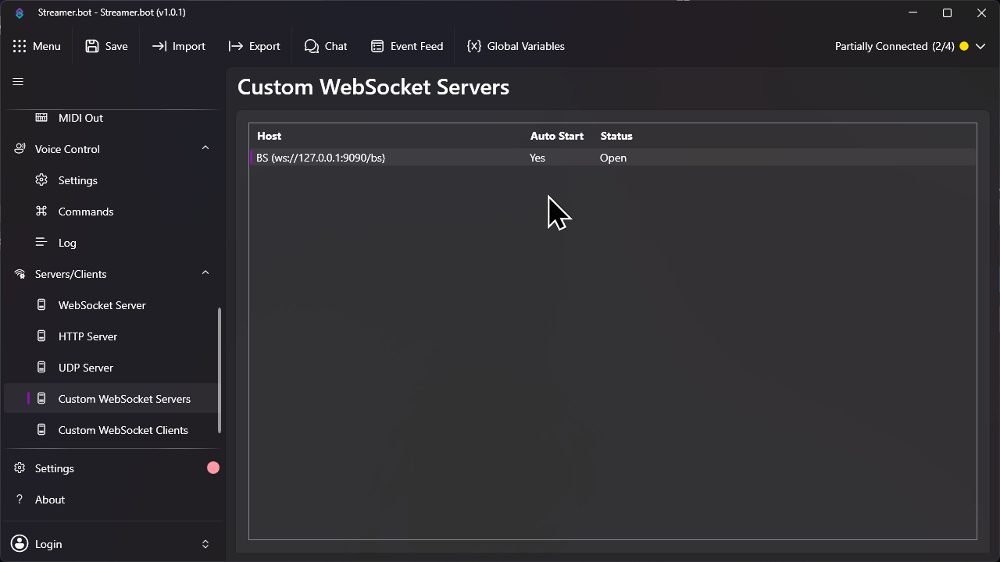
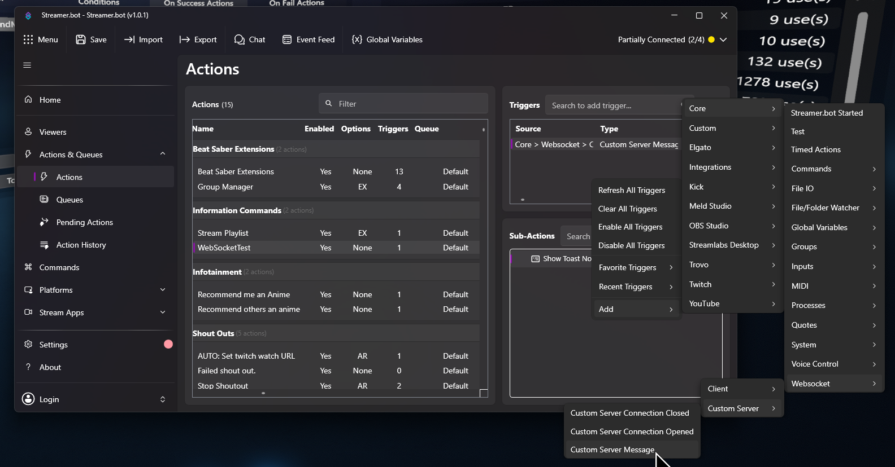
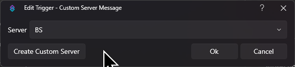
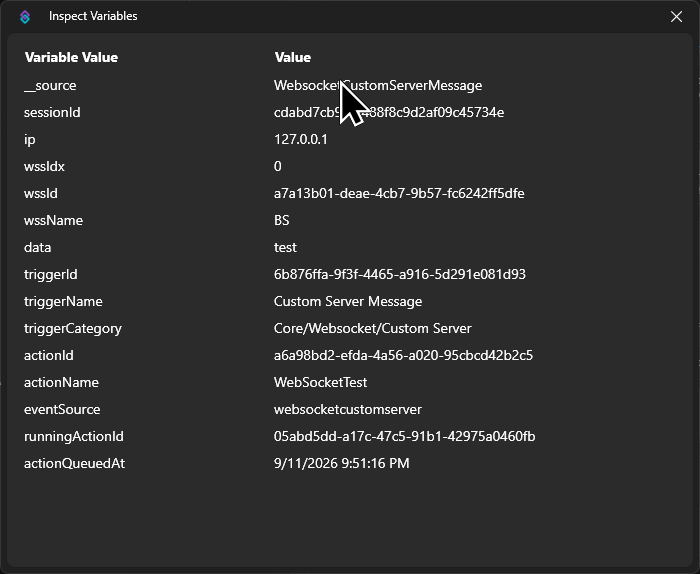
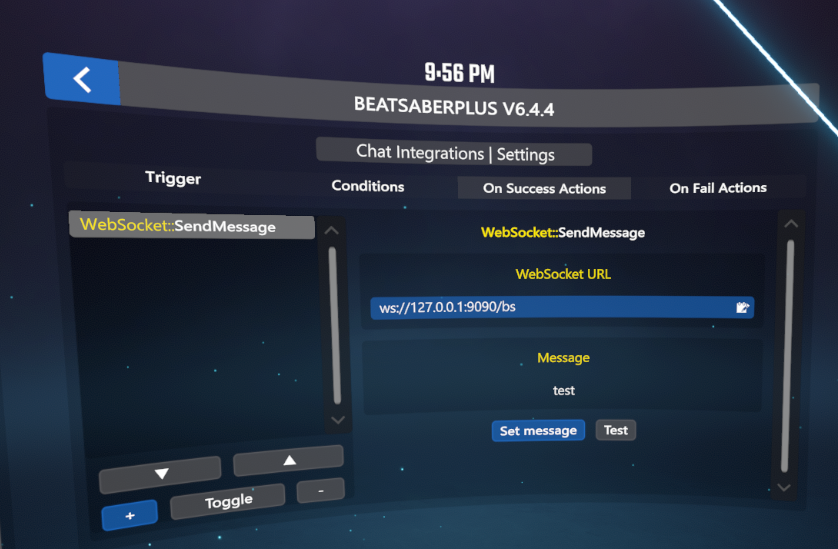

# Triggering Streamer.bot from Beat Saber over WebSocket

This guide wires a Chat Integrations event in Beat Saber to a Streamer.bot action. Beat Saber connects to a WebSocket server hosted by Streamer.bot, sends one text message, and Streamer.bot branches on that message.

Tested with Streamer.bot v1.0.1, BeatSaberPlus 6.4.4 and HTTP Hook 1.1.0 on Beat Saber 1.40.8.

## How it works

1. Streamer.bot runs a **Custom WebSocket Server** and listens on a local address.
2. A Chat Integrations event in Beat Saber has a **WebSocket::SendMessage** action. When the event fires, the action opens a connection to that address, sends the message text, and closes the connection again. Nothing stays connected in between.
3. A Streamer.bot action with the **Custom Server Message** trigger receives the text in the `%data%` variable and can run any sub-actions based on it.

## Part 1: Streamer.bot

### 1. Create the WebSocket server

Open **Servers/Clients** > **Custom WebSocket Servers** in the left sidebar. Right-click the empty list and add a server:

| Field | Value |
|---|---|
| Name | `BS` (any name, used to pick the server in triggers) |
| Address | `127.0.0.1` |
| Port | `9090` (any free port) |
| Endpoint | `/bs` |
| Auto Start | on |

Start the server. The **Status** column should read **Open**.

The full address Beat Saber will connect to is `ws://<address>:<port><endpoint>`, in this example `ws://127.0.0.1:9090/bs`.

### 2. Create an action with the Custom Server Message trigger

Go to **Actions & Queues** > **Actions** and create a new action, for example `WebSocketTest`.

In the **Triggers** panel, right-click and choose **Add** > **Core** > **Websocket** > **Custom Server** > **Custom Server Message**.

In the trigger dialog, pick the server you created and confirm with **Ok**.

### 3. Use the message in sub-actions

Every message Beat Saber sends arrives with these variables:

| Variable | Contents |
|---|---|
| `%data%` | The message text exactly as configured in Beat Saber, after variable substitution |
| `%wssName%` | Name of the receiving server, e.g. `BS` |
| `%ip%` | Address of the sender, `127.0.0.1` when both run on the same PC |
| `%sessionId%` | Id of the short-lived connection, different on every trigger |

To switch on the message, add a **Core** > **Logic** > **If/Else** sub-action that compares `%data%` with the text you expect, and put the real work behind it. If you want one Streamer.bot action per message instead, give each action its own Custom Server Message trigger on the same server and add the If/Else check at the top of each.

A quick way to verify the plumbing is a **Core** > **System** > **Show Toast Notification** sub-action with `%data%` in the text.

## Part 2: Beat Saber

### 4. Add the action to an event

In game, open **BeatSaberPlus** > **Chat Integrations**, select the event that should notify Streamer.bot, and switch to the **On Success Actions** tab. Press **+** and pick **WebSocket** > **SendMessage**.

Configure the two fields:

- **WebSocket URL**: the server address from step 1, `ws://127.0.0.1:9090/bs`.
- **Message**: press **Set message** and type the text Streamer.bot should receive. The keyboard offers the event's values as `$Name` buttons, for example `$HookName` on an HTTPHook event or `$UserName` on chat events. They are replaced with the real values when the event fires.

Press **Test** to send the message immediately. Streamer.bot should run the action, and the game shows "Message sent!" or the error.

Make sure the event itself is enabled with the **Toggle** button, then trigger it normally.

## Troubleshooting

- **"Timed out after 5000ms"**: Streamer.bot is not listening on that address. Check the server's Status is Open and the port and endpoint match the URL exactly, including the leading slash.
- **"Invalid WebSocket URL"**: the URL must start with `ws://` or `wss://`.
- **Test works but the event does not**: the event is disabled, or a condition on it fails. Check the Conditions tab and the Toggle state.
- **Streamer.bot action runs but If/Else never matches**: compare against `%data%`, not `%message%`, and watch for trailing spaces in the message text. Use **Inspect Variables** on the action history entry to see the exact value received.
- **Two events fire at once and only one arrives**: each trigger opens its own connection, so this should not happen. Look at the Beat Saber log for `[WebSocket_SendMessage]` lines with the error.

The connection is plain `ws://` on localhost. If Streamer.bot runs on another machine, bind its server to a LAN address and use that address in the URL. Only use `wss://` if you put a TLS proxy in front of Streamer.bot.
